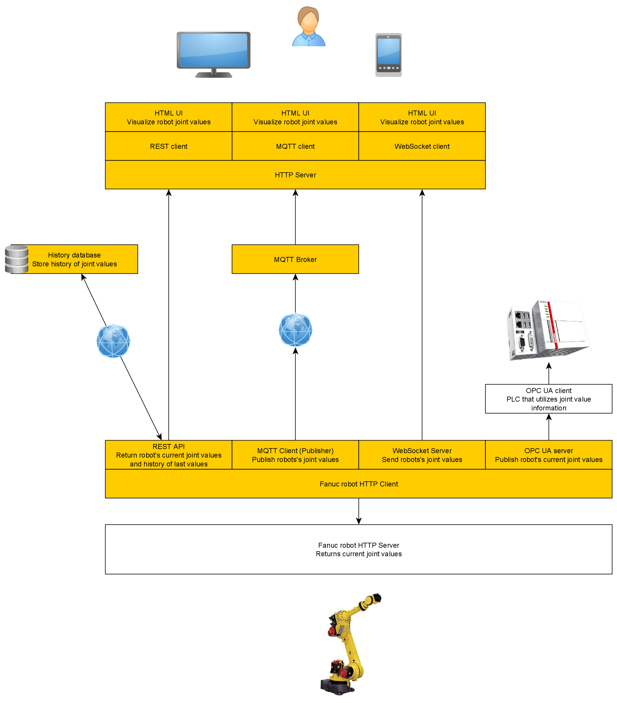

# Kurssin aloitus

## Kurssin sisältö

- Rinnakkaisten ja hajautettujen järjestelmien periaatteet
- Kommunikointiprotokollat
    - REST
    - WebSocket
    - MQTT
    - WebRTC
    - OPC UA
- Tiedon varastointi ja visualisointi
- Teollisuuden tietojärjestelmien integrointi
- Harjoituksia
- Harjoitustyö
- A4-mittainen kirjallinen työ

## Arviointi
- Kirjallinen työ (1/3)
- Harjoitustyö (2/3)

# Tunneilla toteutettava harjoituskokonaisuus
Tavoitteena kommunikoida Fanuc-robotin ohjaimen kanssa  
ja kerätä ohjaimelta tietoa robotin tilasta.

Luodaan erilaisia rajapintoja, joista robotin tilatietoa voidaan kysellä.

