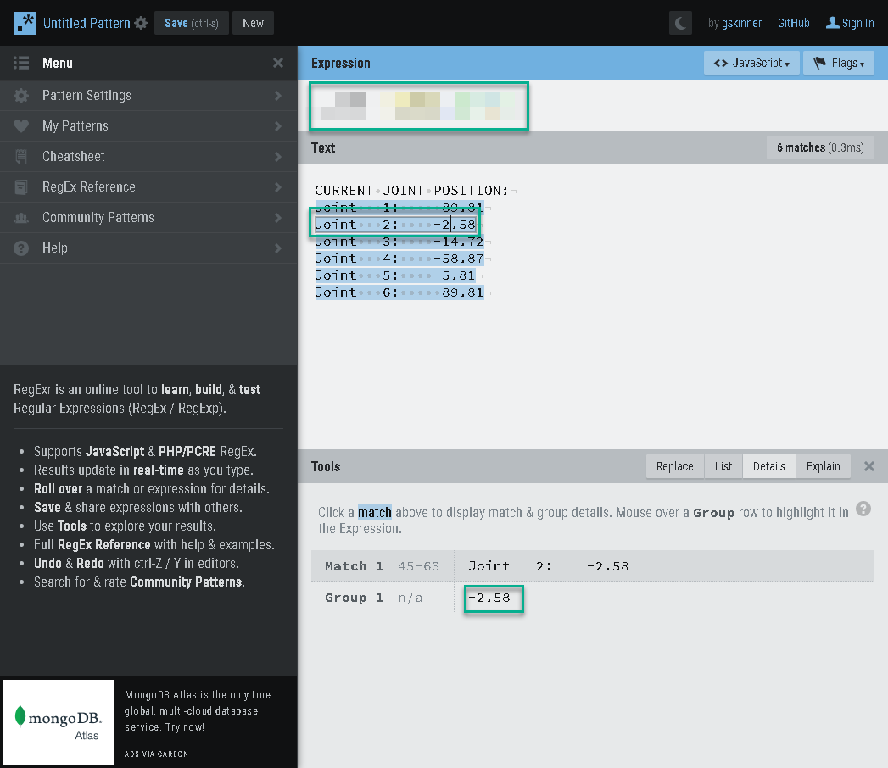

# Robot factory client

## Fanuc robotin HTTP-rajapinta (simulaattori)
https://fanuc-robot-http-server.herokuapp.com/


## Tehtävä - REST-rajapinta robotin nivelarvoihin

Luo REST-rajapinta, joka palauttaa robotin nivelarvot listana.
Rajapinnan osoite on http://localhost:8081/robot/joint_values/

### Parsi robotin nivelarvot robotti-ohjaimen palauttamasta html-sivusta
- Tee axiosilla kysely robotin ohjaimelle (https://fanuc-robot-http-server.herokuapp.com/)
- Parsi robottiohjaimen html-vastauksesta robotin nivelarvot

```
CURRENT ROBOT POSITION::
Group #:  1
 
CURRENT JOINT POSITION:
Joint   1:     86.79
Joint   2:     10.21
Joint   3:    -10.41
Joint   4:    -41.63
Joint   5:     22.98
Joint   6:     86.79

Frame #:  0  Tool #:  7
CURRENT USER FRAME POSITION:
X:    622.47
Y:    836.54
Z:    328.94
```

```javascript
// Esimerkki parsitusta datasta
console.log(joint_values);
//[ -28.16, 11.89, -12.24, -48.97, 26.75, -28.16 ]
```

- Parsintaan voit hyödyntää esimerkiksi regexiä
- Regex-lausekkeen määrittämiseksi voit hydyntää https://regexr.com/ -sivustoa
- Kopioi sivuston teksti-kenttään robotin palauttama data
- Etsi regex-lauseke, joka löytää kuusi osumaa
- Oikea regex-lauseke löytyy tarvittaessa alla olevasta esimerkistä


```javascript
const regexp = 'Joint   [1-6]: *(-?.*)';
let joint_values = [];
let matches = res.data.matchAll(regexp);
let count = 0;
for (const match of matches) {
    count++;
    if (count > 6) break;
    const value = parseFloat(match[1]);
    joint_values.push(value);
}
```

### Luo REST-rajapinta /robot/joint_values/

```javascript
app.get("/robot/joint_values/", (req, res, next) => {
    // 1) Tee kysely robotin ohjaimelle
    // 2) Parsi nivel arvot
    // 3) Lähetä vastaus res.send(joint_values)
}
```
- Testaa menemällä selaimella osoitteeseen http://localhost:8081/robot/joint_values/
- Selaimessa pitäisi näkyä nivel-arvot

